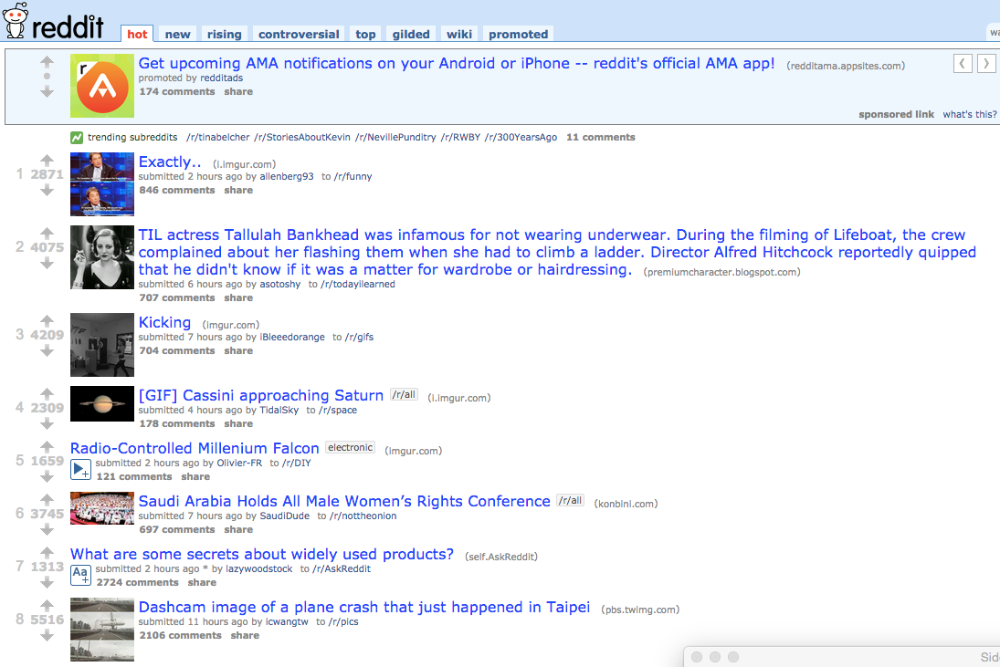

# Reddit

## Description
Build Reddit (bookmarks and voting in Rails using Forms and relationships)

## Objectives

### Learning Objectives

After completing this assignment, you should…

* Be able to utilize Forms in Rails
* Be able to add custom routes to your resources

### Performance Objectives

After completing this assignment, you be able to effectively use

* Modeling Data
* Publishing on Heroku

## Details

### Deliverables

* A rails app repo with:
  * Rails 4.2.0
  * Functioning db/seed.rb
* A link to a live Heroku instance

### Requirements

* Reddit is "User-generated news links. Votes promote stories to the front
  page."
* Each Link should have many Votes associated with it.
* The homepage should order by the most number of votes
* Clicking on a link should create a positive vote

## Normal Mode
Normal mode is a simple, naive, implementation of Redit

            
## Hard Mode

* Clicking "DOWN" should create a negative vote
* Add a `User` who `has_many links`
* When submitting a link, allow user to select themselves in a drop down
* Check the Links for unique URLs and

## Insane Mode

* Make the user sign in using `Devise` or similar
* Create a subdomain for each "sub-reddit", like LOL and Gifs

## Notes

* To launch on heroku, you'll need the [Heroku Toolbelt](https://toolbelt.heroku.com/)
  and a [Heroku Account](https://signup.heroku.com/login)

## Additional Resources

* Read [Active Record Associations](http://guides.rubyonrails.org/association_basics.html)
* Read [Rails Routing from the Outside In](http://guides.rubyonrails.org/routing.html)
* Read [Action Controller Overview](http://guides.rubyonrails.org/action_controller_overview.html)
